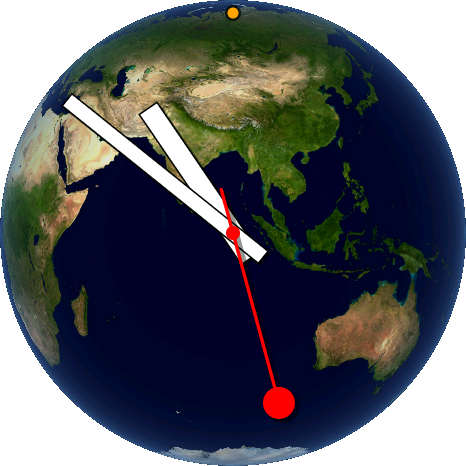

# High Noon Earth Clock

An analog clock whose face is the real Earth, lit by the real sun, right now.

<p align="center"></p>

The globe is always centered on the point where the sun is directly overhead, so
*high noon somewhere on Earth sits under the pivot of the hands*. The Earth turns
under you through the day, and the tilt follows the seasons. North is up, and a
small orange dot marks 12 o'clock. The hands are Swiss-railway style: flat white
bars for hours and minutes, and a red second hand ending in a disc.

Tap the screen to switch a soft hourly double chirp on or off (a bell icon
confirms). It runs on the **Waveshare ESP32-S3-Touch-AMOLED-1.75** (466x466 round
AMOLED, 16 MB flash, 8 MB PSRAM).

This screenshot is a real frame grab from the device (`tools/screenshot.py`).

## How it works

**Where is the sun?** From the current UTC time the firmware computes the sun's
declination and right ascension with a low-precision solar-position formula
(mean longitude and anomaly plus the equation of center, accurate to well under a
degree) and Greenwich sidereal time. That gives the *subsolar point*, the latitude
and longitude where the sun is at the zenith.

**Drawing the globe.** The view is an orthographic projection centered on the
subsolar point with north up. For every pixel inside the disc the firmware works
out the 3-D point on the sphere, converts it to latitude and longitude, and
bilinearly samples a 2048x1024 equirectangular Earth texture (NASA Blue Marble,
held in PSRAM). Shading follows the angle to the sun. Because the sun is at the
center of the view, the day/night terminator lies exactly on the rim, so you
always see the sunlit hemisphere, darkening and picking up a blue atmospheric
haze toward the edge. The rim is anti-aliased with a per-pixel coverage table.

**Refresh rate.** The Earth turns 15 degrees per hour, which is about a quarter of
a pixel per 15 seconds at the center, so the globe is re-rendered every 15
seconds (`GLOBE_UPDATE_MS`) and just looks like continuous drift.

**Keeping the hands smooth.** Rendering the globe takes about 0.9 s, so it runs
as a task on core 0 into a back buffer that is swapped in when done. Core 1 runs
the display loop: copy the finished globe into a 466x466 RGB565 frame, draw the
shadowed hands and the bell with a small software anti-aliased line/bar
rasterizer, and push the frame over QSPI at about 10 fps. The second hand sweeps
continuously from the microsecond clock.

**Time.** At boot the system clock is set from the board's PCF85063 RTC. If you
give it Wi-Fi credentials it also syncs over NTP at boot and every 6 hours, writes
the result back to the RTC, and turns Wi-Fi off. Time can also be set over serial.
The timezone is a POSIX TZ string compiled in (`LOCAL_TZ`), so DST is handled.

**Touch and chime.** A task polls the CST9217 touch controller. A short, barely
moving touch is a tap, which toggles the chime (stored in flash). The chime is
two 100 ms rising chirps synthesized in code, played through the ES8311 codec
over I2S with the speaker amplifier enabled only while it sounds.

**Screen rotation.** The panel is mounted turned relative to the firmware's
"upright" drawing space. The driver's own flip setting mirrors the image on this
panel, so the rotation is done in software at draw time instead.

## Hardware

Waveshare ESP32-S3-Touch-AMOLED-1.75 (plain 1.75, not the 1.75C). Pins used:

| Function | Pins |
|---|---|
| Display (CO5300, QSPI) | CS 12, SCLK 38, D0-D3 4/5/6/7, RESET 2 |
| I2C (RTC 0x51, touch 0x5A) | SDA 15, SCL 14 |
| Touch | INT 11, RESET 40 |
| Audio (ES8311) | MCLK 42, BCLK 9, WS 45, DOUT 8, DIN 10, amp enable 46 |

## Build

Requirements: [arduino-cli](https://arduino.github.io/arduino-cli/) (or the Arduino
IDE's bundled copy), ESP32 Arduino core 3.3.x, and the libraries
`GFX Library for Arduino` and `SensorLib`. The texture baker needs Python 3 with
`numpy` and `pillow`.

```sh
arduino-cli lib install "GFX Library for Arduino" SensorLib
pip install numpy pillow pyserial
tools/build.sh /dev/cu.usbmodemXXXX     # omit the port to only compile
```

`tools/build.sh` downloads the NASA texture, bakes it to a binary that gets
embedded in the firmware (`tex.h` and `earth_tex.bin` are generated, and `tex.h`
contains an absolute path, so they are not committed), then compiles and uploads
with: 16 MB flash, OPI PSRAM, USB CDC on boot, and the 8 MB app partition from
`partitions.csv` (the texture makes the app about 5 MB). The `upload.maximum_size`
override in the script is needed because the board menu's size check does not
read `partitions.csv`.

Edit these near the top of `HighNoonEarthClock.ino`: `LOCAL_TZ` (timezone),
`CHIME_VOLUME` (0-100, roughly 5 dB per 10), `GLOBE_UPDATE_MS`.

## Serial commands (115200 baud)

| Command | Effect |
|---|---|
| `T<unix epoch>` | set the clock and RTC, e.g. `T1789883133` |
| `W<ssid><TAB><password>` | save Wi-Fi in flash and sync time now |
| `X` | forget saved Wi-Fi |
| `C` | play the chime |
| `S` | dump a screenshot frame (used by `tools/screenshot.py`) |

Enter Wi-Fi without leaving the password in shell history:

```sh
read "s?Wi-Fi name: "; read -s "p?Password: "; echo; printf 'W%s\t%s\n' "$s" "$p" > /dev/cu.usbmodemXXXX
```

## Limitations and ideas

- Wi-Fi is set over USB serial and the timezone is compiled in. A phone-based
  setup page (temporary access point with a QR code on screen) would make it
  shareable.
- Only the sunlit hemisphere is ever shown by design, so there are no city lights.
- Chime quiet hours would be a natural addition.

## Credits

- Earth imagery: NASA Visible Earth, *Blue Marble: Land Surface, Shallow Water,
  and Shaded Topography*. Fetched by `tools/build.sh`, not stored in the repo.
- `es8311.c`, `es8311.h`, `es8311_reg.h`: Espressif ES8311 driver (Apache-2.0), as
  shipped in Waveshare's example for this board.
- Libraries: [GFX Library for Arduino](https://github.com/moononournation/Arduino_GFX),
  [SensorLib](https://github.com/lewisxhe/SensorLib).

## License

MIT, see [LICENSE](LICENSE). The bundled ES8311 driver files are Apache-2.0.
